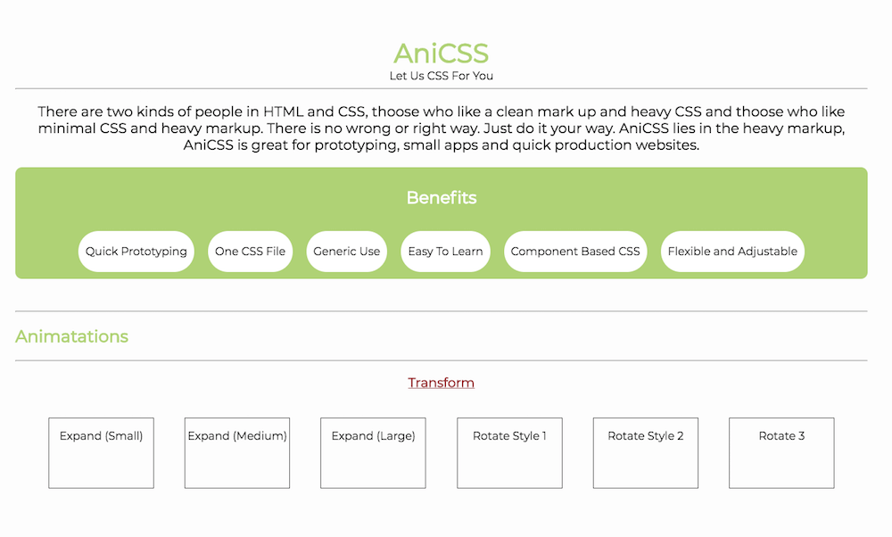
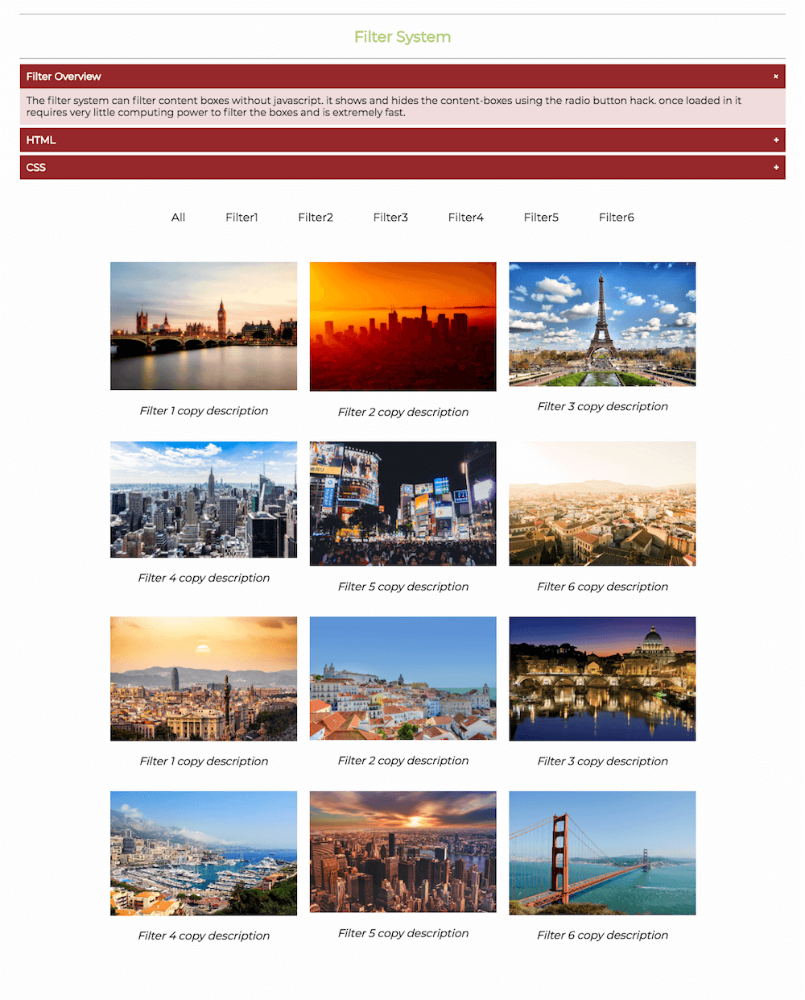

# AniCSS

> __**Want to quickly build a site with just html knowledge?**__  
> __**Are you looking for a quick prototyping tool?**__    
> __**Do you dislike CSS?**__  

## Let Us CSS For You

AniCSS is a custom built library that provides classes with reuseable functionility that makes it easier to build or make quick changes to your site without having to maintain a CSS file. It also has many reuseable components using simple and complex CSS animations.

- [Go To Live Project](https://stefantrinh1.github.io/AniCSS/)

You may be suprised to see the power of just CSS without javascript. Go to the live project for a demostration of features available in this library.

  

## Benefits

- Can be used without any CSS knowledge
- Easy to use
- A quick and small single file 
- Also customisable CSS and HTML

## How to Install

Installation is not required as the code snippets are provided for copying and pasting in the live project site.  
However should you wish to install AniCSS you only need to download one CSS File and add it to your project.

[Click To View AniCSS CSS File](https://stefantrinh1.github.io/AniCSS/anicss.css)

Basic knowledge of HTML would be useful here

1. Click to view [AniCSS CSS File](https://stefantrinh1.github.io/AniCSS/anicss.css)
2. Right Click the Page and click Save As.
3. Save The File in your project folder.
4. Put this in head of the HTML "<link rel="stylesheet" href="anicss.css"/>" (make sure its in the same location as the html file you are using the css file in)

## Construction

- Html
- CSS

## Plans To Include

- Button Animations
- Text Animations

## Contact Details

If you have any questions or would like to get in touch, please contact me using the details below.

__**Stefan Trinh**__  
Web Developer  

e: stefantrinh1.work@gmail.com  
g: https://github.com/stefantrinh1  
w: http://www.stefantrinh.co.uk  
